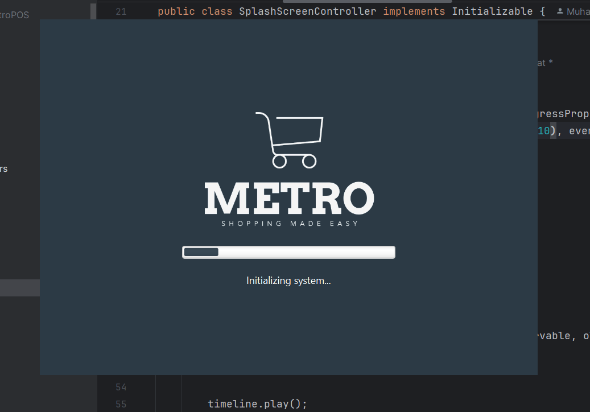
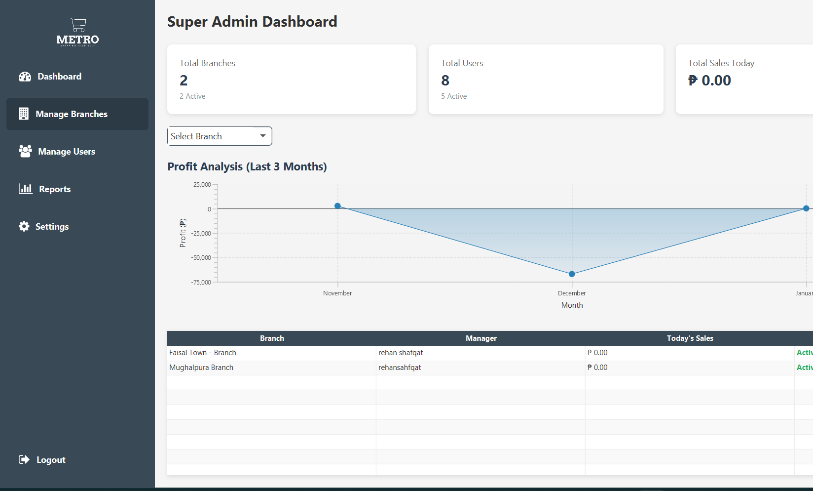
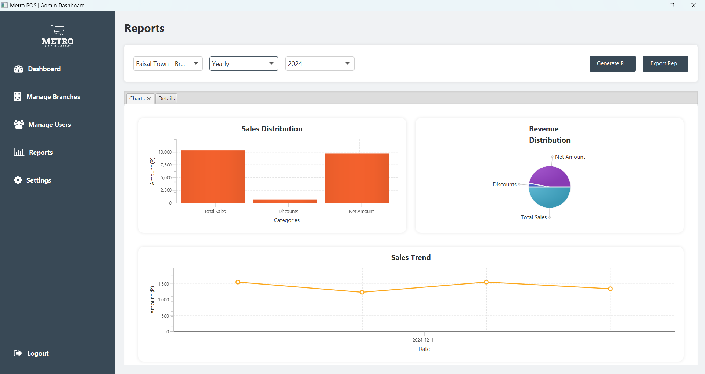
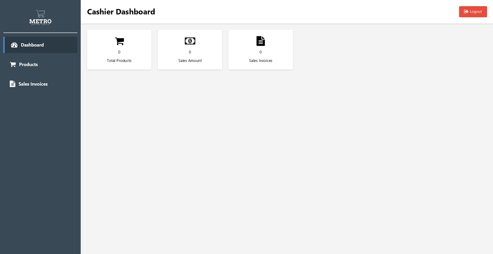

# Metro POS System

## Project Overview

The **Metro POS System** is a point-of-sale software designed for retail stores and supermarkets. The system provides user roles with specific access and functionality, including Super Admin, Branch Manager, Data Entry Operator, and Cashier.

## Screenshots

<div style="display: flex; justify-content: space-evenly; gap: 10px; margin-bottom: 10px; align-items: center;">
  
  
</div>

<div style="display: flex; justify-content: space-evenly; gap: 10px; align-items: center;">
  
  
</div>

## Features

### 1. Splash Screen

A loading screen upon application startup.

### 2. Login Screen

Roles available for login:

- Super Admin
- Admin/Branch Manager
- Cashier
- Data Entry Operator

### 3. Super Admin Functionality

**Branch Management**:

- Create and manage branches.
- Add Branch Manager with initial credentials.
- Branch details:
  - Branch ID/Code
  - Name
  - City
  - Active status (true/false)
  - Address
  - Phone
  - Number of employees (initially 0)

**Report Generation**:

- Reports based on specified date ranges:
  - Daily, Weekly, Monthly, Yearly
- Types of reports:
  - Sales
  - Remaining stock
  - Profit
- Graphical representations (charts) of reports.

### 4. Admin/Branch Manager Functionality

**First Login**:

- Mandatory password change for all employees.

**Employee Management**:

- Add Cashiers and Data Entry Operators.
- Employee attributes:
  - Name
  - Employee Number (#Emp No)
  - Email
  - Initial password (`password`)
  - Branch Code
  - Salary

**Reports**:

- View and manage reports similar to super admin but for the specific branch.

### 5. Data Entry Operator Functionality

**First Login**:

- Mandatory password change.

**Vendor/Supplier Management**:

- Add new vendors.
- Fetch existing vendor information.

**Product Management**:

- Add products received from vendors.
- Product attributes:
  - Name
  - Category
  - Original Price
  - Sale Price
  - Price by unit
  - Price by carton
- Save product information.

**Offline Mode**:

- In case of no internet, data is stored in an offline database.
- On application startup, the system syncs the offline database with the online database once internet connectivity is restored.

### 6. Cashier Functionality

**Sales Management**:

- Record purchased products.
- Update the database by reducing the stock count after generating the bill.
- Display total sale amount and generate receipts.

## Technical Details

- **Programming Language**: Java
- **UI Framework**: JavaFX
- **Database**: PostgreSQL

## Installation Instructions

1. **Clone the Repository**:
   First, clone the repository to your local machine using the following command:
   ```bash
   git clone https://github.com/Gate-Solutions/MetroPOS
   ```
2. **Install Dependencies**:
   - Ensure you have Java Development Kit (JDK) installed.
   - Run the following command in terminal to install the Dependencies:
   ```bash
   mvn clean install
   ```
3. **Database Setup**:
   - Install PostgreSQL database in your local environment.
   - Modify .env.example file with your database credentials (offline and online both) and rename it to .env .
   - Run InitializeLocalDatabase.java to initialize the offline database.
   - Run InitializeOnlineDatabase.java to initialize the online database.
4. **Compile and Run**:
   - Run the Main.java file to start the application.
